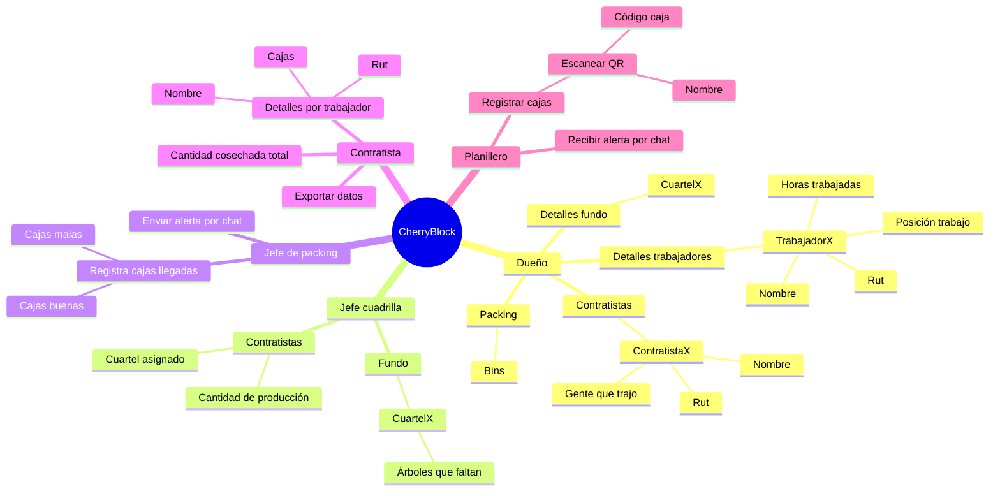

# CherryBlock

Aplicación para la gestión completa de cosecha de cerezas con distintos tipo de usuarios y funcionalidades especificas para cada rol. Permite registrar la producción de los cosecheros mediante QRs únicos, controlar el avance de los cuarteles e hileras cosechadas, llevar un seguimiento de cajas y bins, realizar inspecciones en packing y entregar reportes claros a los dueños y contratistas.

## Roles y funcionalidades
### Dueño
* Acceso total a registros y reportes.
* Puede crear y editar usuarios, contratistas, cuarteles e hileras.
* Visualiza: Cajas totales, bins, porcentaje de rechazo y producción por contratista.

### Jefe de cuadrilla
* Asigna contratistas y cuadrillas a cuarteles e hileras.
* Registra cuantas plantas quedan por cosechar por cuartel.
* Supervisa la actividad de su equipo.

### Jefe de packing
* Registra la llegada de cajas a inspección.
* Clasifica las cajas buenas y malas, deja comentarios de advertencia.
* Puede enviar alertas directas al planillero sobre los problemas (Ej: caja con hojas, bajo llenado).

### Contratista
* Visualiza la producción de su personal.
* Reporte de cajas y bins generados.
* Puede exportar datos diarios.

### Planillero
* Registra la cantidad de cajas generadas por trabajador.

### Diagrama

